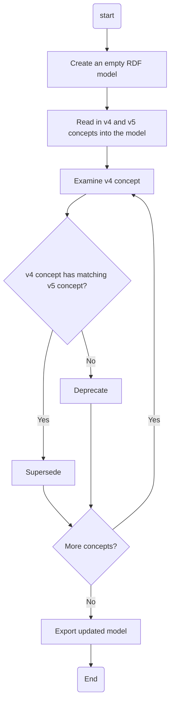

# Upgrading to CaLAThe v5

## Building

One time only
```
python3 -m venv ./venv
source ./venv/bin/activate
pip3 install rdflib
```

Then each you build

```
python3 process.py
```


## The worflow implemented by the script can be summarised as follows.


