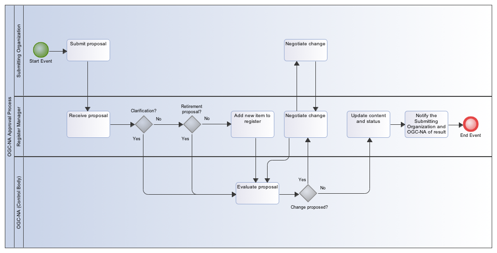

== Name registration

=== OGC name categories

An OGC Name may fall into one of the following categories:

{counter:item_number:1}. A _category A_ name designates a discrete resource available from a service, such as a repository. These shall be registered as discrete items in the OGC name register:

EXAMPLE 1: http://www.opengis.net/doc/AS/Topic6

EXAMPLE 2: urn:ogc:doc:AS:Topic6

{counter:item_number:2}. A _category X_ name is constructed as required, according to a rule or algorithm, and may or may not be associated with a discrete accessible resource. These shall be registered as a class, with a description of (or reference to) the rule or algorithm for names of this class:

EXAMPLE: http://www.opengis.net/def/uom/SI/0/m%2Fs

EXAMPLE: urn:ogc:def:uom:SI::m%2Fs

=== Submission process

Name registration is initiated by submission of a proposal to the OGC Naming Authority names@opengeospatial.org.

A name registration submission shall contain the following information:

Category A name:

* the identity of the person or organization requesting the name assignment
* the resource type selected from the register at  http://www.opengis.net/register/ogc-na/type.
* the OGC Name requested
* one of:
** the locator for the resource
** a representation of the resource that may be hosted by OGC

*NOTE:* The last option may be the case for 'def' names.  The name must conform to the rules for names of that type, which may require that items are present in dependency registers used in the name production rule for that type.

EXAMPLE 1:  http://www.opengis.net/doc/IS/WMS/1.3.0  -> http://portal.opengeospatial.org/files/?artifact_id=4756

EXAMPLE 2:  urn:ogc:doc:IS:WMS:1.3.0 -> http://portal.opengeospatial.org/files/?artifact_id=4756

Category X names:  the identity of the person or organization requesting the name assignment

* the resource type selected from the register at  http://www.opengis.net/register/ogc-na/type.
* a template for the set of OGC Names requested, with a variable for each element to be populated according to a rule or algorithm
* the rule or algorithm for populating each variable in the template, including a reference to any dependency resource
* one of:
(preferred) a locator for a service that can provide a description of each resource in this set
** one of:
*** locator for a definition of the set of resources
*** representation of the definition of the set of resources

The name must conform to the rules for names of that type, which may require that items are present in dependency registers used in the name production rule for that type.

EXAMPLE 1: http://www.opengis.net/def/crs/EPSG/0/4326  -> http://www.epsg-registry.org/indicio/query?request=GetRepositoryItem&id=urn:ogc:def:crs:EPSG::4326

EXAMPLE 2: http://www.opengis.net/def/uom/UCUM/0/m%2Fs  -> http://unitsofmeasure.org/ucum.html

EXAMPLE 3: urn:ogc:def:crs:EPSG::4326  -> http://www.epsg-registry.org/indicio/query?request=GetRepositoryItem&id=urn:ogc:def:crs:EPSG::4326

EXAMPLE 4: urn:ogc:def:uom:UCUM::m%2Fs  -> http://unitsofmeasure.org/ucum.html

Name registration will always involve the addition of items to one or more OGC-NA registers. A name assignment request shall attempt to identify all the register changes that are required, and shall ensure that the information required for each register conforms to the requirements for that register, and shall verify that an OGC name for this resource has not already been allocated.

=== Processing of name assignment requests

The registration process generally follows the discipline described in ISO 19135. Items are inserted into the relevant OGC-NA Registers on submission, with the status "invalid". If a registration request is accepted the item status is set to "valid".  Items may subsequently be "superseded" (typically if the locator is changed) and a pointer to its successor recorded, or "retired" (if the resource is no longer available). An item that supersedes an earlier item shall have a pointer to its predecessor.

An illustration of the approval process is shown in <<img_approval_process>>.

[#img_approval_process,reftext='{figure-caption} {counter:figure-num}']
.Illustration of the approval process

A proposal management record shall be maintained with the following status flags, along with the dates of creation or modification of the record:

* deprecated
* experimental
* invalid
* notAccepted
* proposed
* reserved
* retired
* stable
* submitted
* superseded
* valid

As a general principle, the OGC-NA will take a "light touch" approach to acceptance of name registration proposals, and it is expected that most proposals will be accepted. The principal grounds for rejection of a name registration will be:

. the resource cannot be obtained using the locator provided
. the resource is not of the type indicated
. the resource already has an OGC name
. the name is not consistent with patterns in use for similar resources  The OGC-NA will process requests in a timely manner.

NOTE: Most discussion and decisions will be made using the issue tracker at https://github.com/opengeospatial/NamingAuthority/issues.
