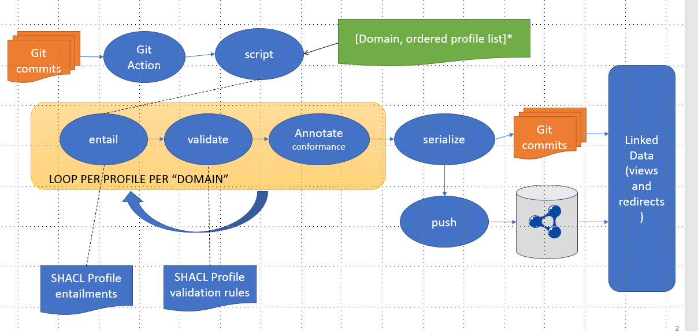

# Entailment and Validation support for publishing OGC resources as Linked Data

## Goals
When the OGC defines a thing (such as a term, specification element, model element) it does it in the context of a governed "container" object (specification, model, etc).

For each of these "containers" the individual resources must be made available, as well as the container itself, and appropriate linkages established so Linked Data navigation and metadata are available. 

There are several types of resource that require specific structures (i.e. a specification description compliant with a model of the OGC Modular Specification)

In addition, viewers rely on common display pattern - in this case a profile based on SKOS.

In the Linked Data environment, multiple profiles may be used to expose each resource in a range of possible forms.

So a suite of complementary profiles may be defined for each transformation and validation goal. These are defined by SHACL rules for entailment and validation, and published as FAIR Linked Data resources in their own right. Data is declared as conformant to each profile it is validated against successfully.

The goal of the entailment and validation system is to ensure that:
1. each container is made available the range of forms most useful for the container type
2. each resource (container and element) has a minimal metadata set to meet OGC policy goals
3. each resource supports of common navigation view (SKOS profile)
4. the right content is loaded to a staging version of the Definitions Server ("defs-dev") for review.


## Components:
1. A git action configuration to trigger the system
2. Script(s) to perform entailment, validation and load to the Definitions Server
3. SHACL graphs containing rules for entailment for each profile required
4. SHACL graphs containing rules for validation for each profile required
5. Formal descriptions of the profiles used in the entailment and validation chain

The process is to entail using an ordered list of profiles: 



* entailments assume an input profile
* post validation conformance statements added to output graph
* profiles are self-describing and form part of final Linked Data ecosystem to explain resources.


## "Domains"

The script is configured to operate on "domains" defined by a directory path within the repository, and the (ordered) set of entailments and validations to be performed.


## Execution
The script runs automatically on commit of files, detecting updates and additions of RDF graphs (.ttl) within the target domains.

It may be executed manually (provision for a batch mode) and may be run locally against a working copy of the repository - using pyCharm or similar.

e.g. 

```python scripts\update_vocabs.py -m specification-elements/defs/15-111r1.ttl```

```python scripts\update_vocabs.py -m definitions/conceptschemes/auth.ttl```

these will generate an entailed version under ./entailed/<uri path>  and a SHACL validation report under <file>.txt 

```(venv) C:\repos\ogc\NamingAuthority>python scripts\update_vocabs.py -h
usage: update_vocabs.py [-h] [-m MODIFIED] [-a ADDED] [-r REMOVED]
                        [-i INITIALISE] [-u] [-b] [-f]

optional arguments:
  -h, --help            show this help message and exit
  -m MODIFIED, --modified MODIFIED
                        Vocabs to be updated in the DB
  -a ADDED, --added ADDED
                        Vocabs to be added to the DB
  -r REMOVED, --removed REMOVED
                        Vocabs to be removed from the DB
  -i INITIALISE, --initialise INITIALISE
                        Initialise Database
  -u, --update          Update Database
  -b, --batch           Batch entail all vocabs ( use -f to force overwrite of
                        existing entailments )
  -f, --force           force overwrite of existing entailments
```

## Outputs
Upon execution the script creates subdirectory under each domain working directory (".") called "./entailed" and "./validation".

Under "./entailed" it creates a directory tree matching the URI path of each output resource and places generated files. This allows the Definition Server to redirect to these resources using the available URI path (the original filename is not know to the redirection logic).

e.g. 

15-111r1.ttl  =>  entailed/landinfra/1.0.ttl

Under ./validation the original filename will be used and validation reports (current just .txt but potentially RDF, HTML, CSV forms may be useful )

*Todo - if verbose debugging flag then validations per profile will be reported in ./validation/file_profiletoken.txt*

